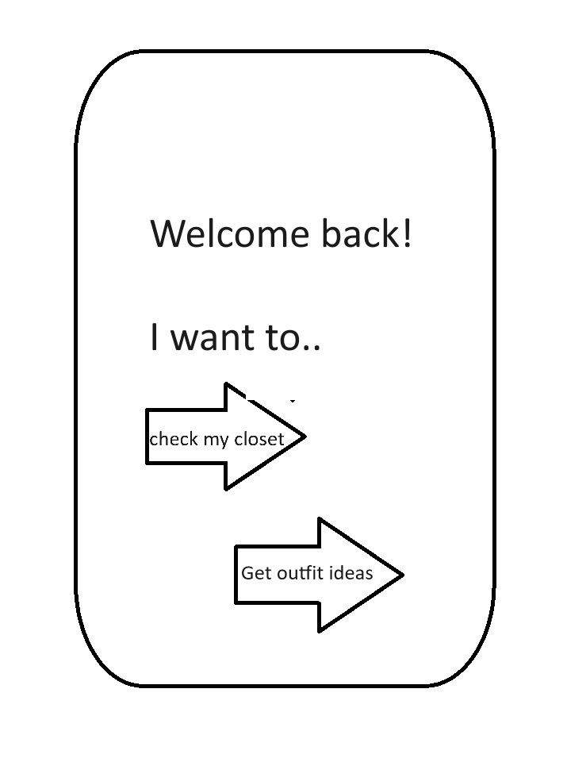
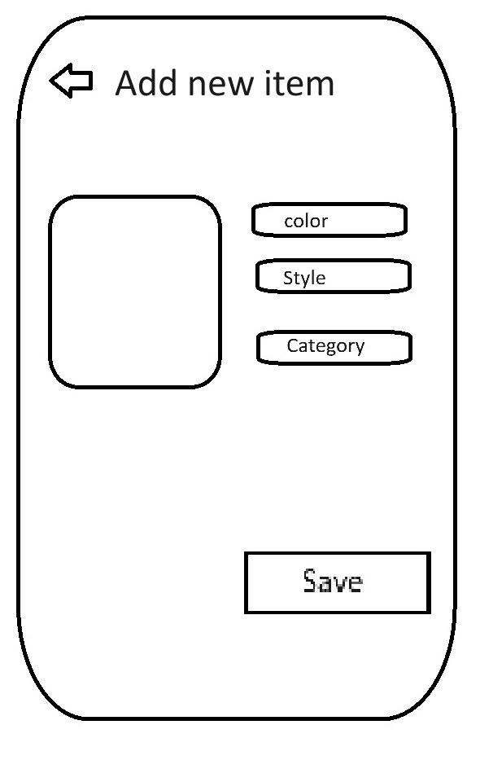
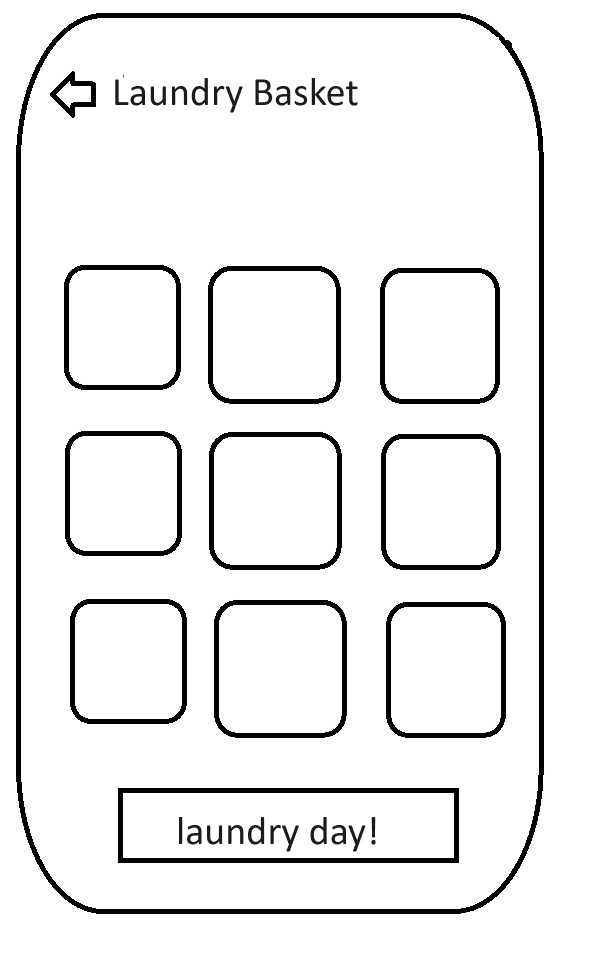
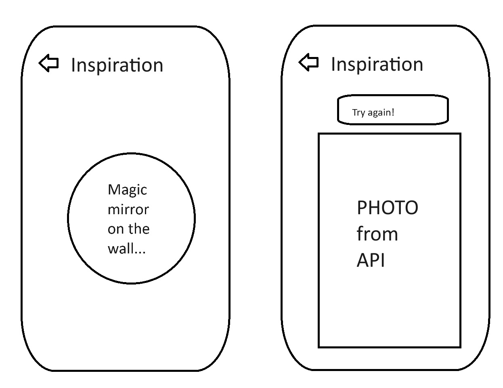

# Project Title

## Overview

A closet management app that allows users to organize their clothes in a way that makes it easy to check what they have and get inspirations on what to wear.

### Problem

- Closet management is a pain for people who have a lot of clothes.
- It is hard to find inspiration for what to wear based on what you have.
- Having a digital inventory can help people to keep track of their clothes and save money.

### User Profile

Young students, mother with kids, busy-schedule workers, and anyone who wants to keep track of their clothes or need inspiration on daily outfits.

### Features
- a database to store clothes details/descriptions ("my closet")
  - a library to store clothes icons/images; or a ready to use API
  - in terms of images, pre-define some clothes 'prototypes' and assign to items based on the category user chooses?
  - find little icons of t-shirts, pants, dresses, etc. i need to control the amount of prototypes to bigger categories?
- a way to get inspiration for what to wear
  - find a fashion API to get outfit specific photos
  - pull a pair of keywords from closet and get inspiration from the fashion API (randomized pair)
- a laudry basket to show checked-out clothes
  - a button attached to each item to check it out to laundry basket
  - shopping-cart to collect & restore all laundry basket items 
  - another seperate database to store laundry basket items?

## Implementation

### Tech Stack

- React
- Node.js
- Express
- database/MySQL
- any library/package to show clothes inventory?
- any library/package to display inspiration cards?

### APIs

- [API to get outfit-specific photos based on key words](https://unsplash.com/)

### Sitemap
- Homepage
- Closet page
  - Add clothes
  - Edit Clothes
  - Existing closets
  - Laundry basket
- Inspiration page

### Mockups

#### Homepage

#### Closet feature

#### Laundry basket

#### Inspiration page

### Data

- Closet: id, description{color, style}, category, image/icon, "dirty" tag

### Endpoints
- GET /closet
- POST /closet
- PUT /closet
- DELETE /closet
- GET /inspiration
- GET /laundry
- PUT /laundry

### Auth

Not required? it's just a personal assistant app

## Roadmap
- Create client
    - react project with routes and boilerplate pages

- Create server
    - express project with routing, with placeholder 200 responses

- Create migrations

- Gather 15 sample closet items

- Create seeds with sample closet item data

- Deploy client and server projects so all commits will be reflected in production

- feature: my closet
  - create

- feature: laundry basket
  - build datafile/database/table to hold all clothes tagged with "dirty"
  - create front-end interfact to display all 'checked-out' clothes, and a button to restore them to closet

- feature: inspiration
  - create Endpoint for API 
  - create front-end interfact to display inspiration image

- Feature: Home page
  - add link to the closet page and inspiration page

- Bug fixes

- DEMO DAY

## Nice-to-haves

Incorporate local weather data to suggest outfits based on the weather.
